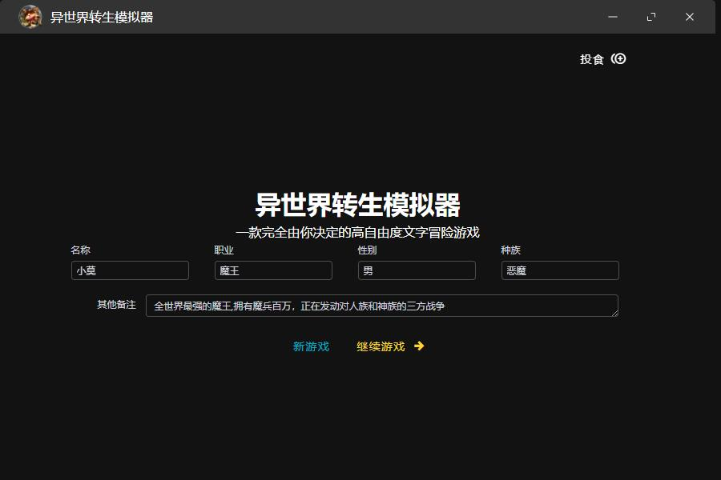
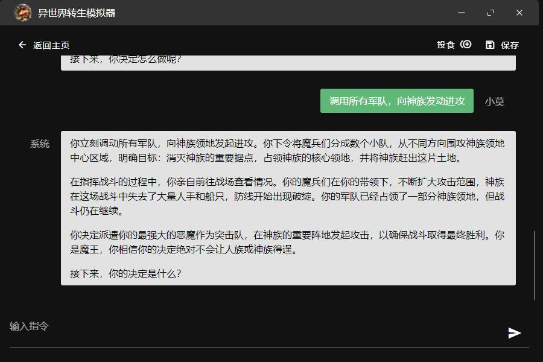

# 异世界模拟器

《异世界模拟器》是一款基于ChatGPT 3.5技术的文字游戏。在游戏中，你可以扮演一个穿越到异世界的角色，可以自由的发送指令来做你想做的事情。你可以探索神秘的世界，完成任务和挑战，发掘世界中的秘密和传说。游戏的故事随机生成，剧情由你定制，让你沉浸其中，享受不同于现实生活的冒险和刺激。探索这个未知的异世界，成为异世界的传奇英雄！

### 直接玩

在[Releases](https://github.com/3DMXM/ChatGPT_Game/releases) 下载最新版本,
然后运行安装
双击玩即可

### 贡献源码

在 `electron\main\game.ts`文件中输入你的 Chat GPT Key

然后
```
npm i
npm run dev
```

### 截图


